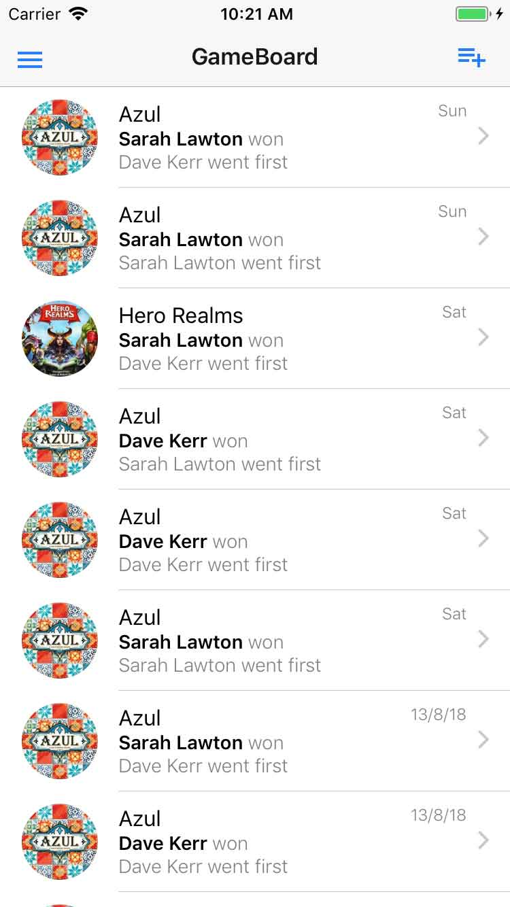
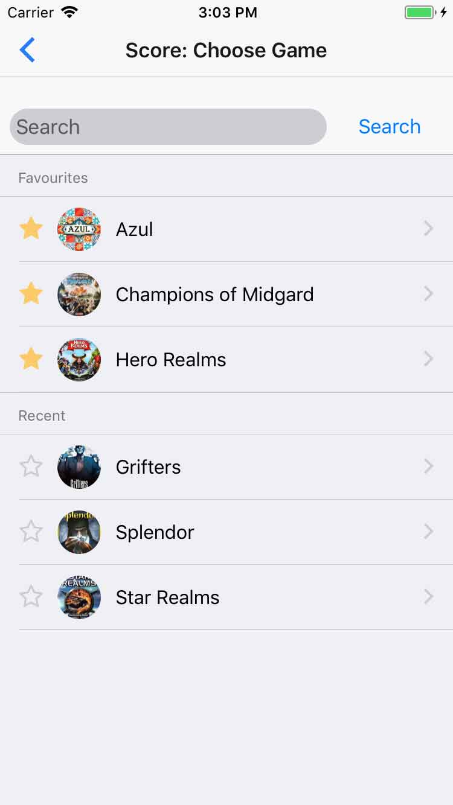
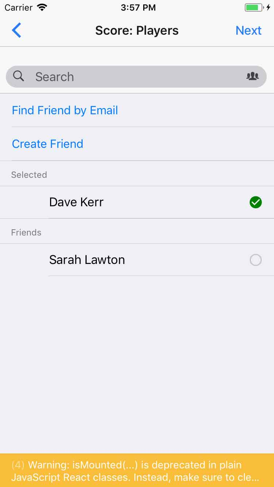
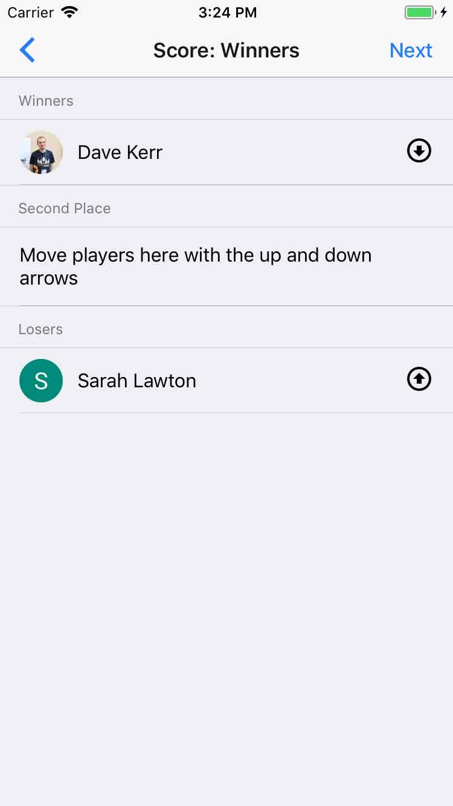
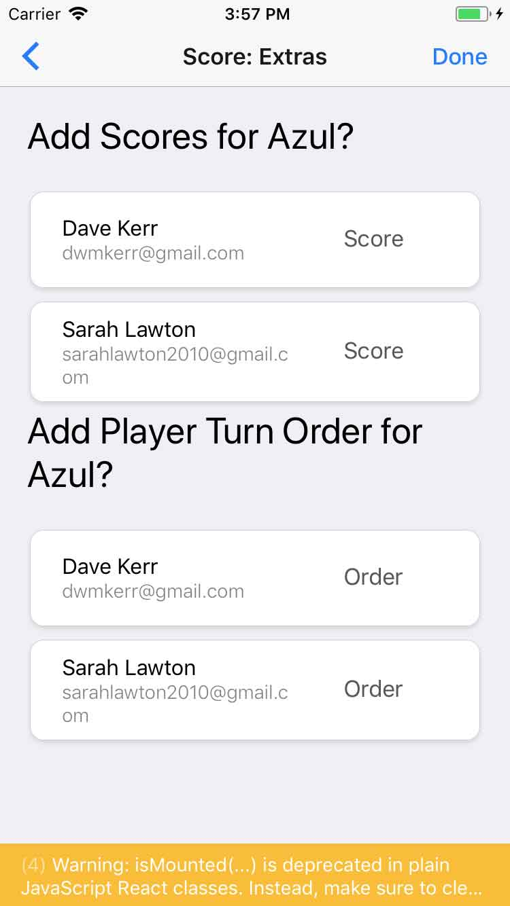

# Track Score

These screens are used to record the details of a played game.

First, choose the 'Add Score' button from the home page:

Then select the game:

Then select the players:

Then select the winners and ranks:

Then add and extras and press 'Done':

